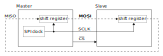
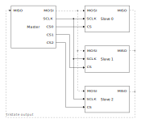
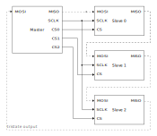
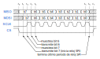
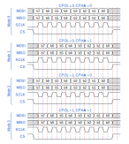
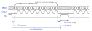

- [1. SPI Specification](#1-spi-specification)
  - [1.1 Overview](#11-overview)
  - [1.2 Conceptual architecture](#12-conceptual-architecture)
  - [1.3 Multiple device configuration](#13-multiple-device-configuration)
  - [1.4 Basic timing](#14-basic-timing)
  - [1.5 Operation modes](#15-operation-modes)
  - [1.6 Undefined aspects](#16-undefined-aspects)
- [2. SPI IP specification (RTL)](#2-spi-ip-specification-rtl)
  - [2.1 Module overview](#21-module-overview)
  - [2.2 Functional Description](#22-functional-description)

# 1. SPI Specification

The SPI (*serial peripheral interface*) standard is a serial data transfer
protocol originally developed by Motorola. The SPI bus is composed of three
lines, including two lines for transmitting and receiving serial data and one
line for a "clock" signal. One master device and multiple slave devices can be
attaches to the bus. The master generates the clock signal and initiates the
data transfer. The SPI standard is widely used in embedded systems to connect
peripheral modules. 

## 1.1 Overview

The SPI standard specifies the protocol to exchange data between two devices via
serial lines. Instead of using UART's oversampling scheme, the SPI interface
includes a third line to control the shifting and sampling of serial data. The
activities are performed at the *transition edge* of the signal. The role is
similar to the clock signal of a synchronous system and thus this line is
referred to as the *SPI clock*.

Unlike the UART setting, in which two systems are symmetric and both can
initiate a transmission, the SPI standard uses a master-slave configuration. The
master controls the overall operation and generated the SPI clock signal. Only
master can initiate a data transfer.

Despite its name, the SPI clock is not a real system clock and should not be
used to drive any register directly. The system clock rate of the SPI controller
is much faster than the rate of the SPI clock. From the SPI controller's point
of view, the SPI clock is just another control signal.

## 1.2 Conceptual architecture

The conceptual diagram of an SPI bus with two devices is shown in Figure **1**. 
Both the master and the slave have a shift register inside. The two
shift registers are connected as a ring via the **MOSI** (for
"master-out-slave-in") and **MISO** (for "master-in-slave-out") lines, and their
operation is coordinated by the same SPI clock signal, **SCLK**. The **MOSI**
and **MISO** signals are somewhat like UART's transmitting signal (tx) and
receiving signal (rx). We assume that both registers are eight bits wide and
data transfer is done on a byte-by-byte basis. In the beginning of the
operation, both master and slave load data into registers. During the data
transfer, data in both registers is shifted to the right by one bit each
**SCLK** cycle. After eight **SCLK** cycles, eight data bits are shifted and the
master and slave have exchanged register values. The master and slave then can
process the received data. This operation can be interpreted that the master
writes data to and read data from to slave simultaneously, which is known as
*full-duplex* operation.

   
  <em>Figure 1: Conceptual diagram of an SPI bus.</em>

In addition to the **MOSI**, **MISO**, and **SCLK** lines, a slave device may
also have an active-low chip select input, **CS** (chip select) also called
**SS_N** (for "slave select"). It can be used for the master to select the
desired slave device if there are multiple slave devices on the bus. Many SPI
devices also use **CS** for certain control functionality and it cannot be
omitted, even in a single-slave configuration.

## 1.3 Multiple device configuration

The SPI standard supports a multiple-slave configuration, in which a master
device can control more than one slave device. There are two basic schemes,
which are the *parallel configuration* and the *daisy-chain configuration*.

The parallel configuration uses a dedicated **CS** line for each slave device,
as shown in Figure **2**. An **CS** line functions as the chip
select signal and the master can select the desired device by asserting the
corresponding line. This configuration can accommodate a master and
“independent” slave devices. Since the **MISO** lines of the slaves are tied
together, the **MISO** line must be driven by a tristate buffer and its output
should be in a high-impedance state when the slave device is not selected.

   
  <em>Figure 2: Parallel configuration</em>

The daisy-chain configuration connects the **MOSI** and **MISO** lines into a
cascading chain, as shown in Figure **3**. A single **CS** line is used
to control all slave devices. Conceptually, the chain forms a large shift
register and the data is transferred serially from device to device. The devices
in this configuration must be "cooperative" and follow the same protocol to
transmit, insert, and extract data byte.

   
  <em>Figure 3: Daisy-chain configuration</em>

## 1.4 Basic timing

The SPI bus uses the *edges* of SPI clock (**SCLK**) to control and synchronize
the bit data transfer. We can define two activities during a bit transfer:
*driving* (i.e., shifting) a new bit to the data line and *sampling* (i.e.,
latching) a bit from the data line. The driving and sampling are completed in
the same SPI clock cycle but take place in opposite clock edges.

A representative timing diagram is shown in Figure **4**. Initially the
bus is idle and the **SCLK** line is 0. At $t_{0}$, the master asserts **CS**
and the designated slave places the first date bit (bit 7) on **MISO** line. At
$t_{1}$, the master start the SPI clock and driver the bit b7 on **MOSI** line.
Since the first half of the SPI clock period is 0, the value on **SCLK** remains
unchanged. At $t_{2}$, the master raises the SPI clock and progresses to the
second half of the clock period. At the 0-to-1 transition edge, the master
samples the data on **MISO** and the slave samples the data on **MOSI**. At
$t_{3}$, the first SPI clock cycle is completed. The master starts the second
SPI clock period and lowers **SCLK**. Both master and slave drive new bits to
the data line. At $t_{4}$, the master raises **SCLK** again and both master and
slave sample the new data bits.

   
  <em>Figure 4: Representative timing diagram of an SPI data transfer</em>

The driving and sampling activities are repeated until eight data bits are
transferred. The last data are sampled at $t_{5}$ and **SCLK** returns to 0 at
$t_{6}$. At $t_{7}$, the master de-asserts **CS**. Note that all samplings are
performed at the rising edges of **SCLK** and all drivings (with the exception
of the initial one) are performed at the falling edges of **SCLK**.

## 1.5 Operation modes

The SPI’s *operation mode* defines the relationships between the SPI clock edges
and driving and sampling activities on the data lines. There are four modes. The
modes depend on two parameters, which are *clock polarity* (abbreviated as
*cpol*) and *clock phase* (abbreviated as *cpha*). The clock polarity is defined
as the value of **SCLK** when it is idle, which can be either 0 or 1. The clock
phase is harder to define. One interpretation is whether a clock edge is used in
driving the first data bit. If *cpha* is 1, the master drives the bit at the
*first transition edge*. If *cpha* is 0, the master drives the bit at the
*zeroth transition edge* (which means no edge or not the first edge).

Based on the two parameters, the SPI mode is defined as follows:

- Mode 0: *cpol* = 0 and *cpha* = 0
- Mode 1: *cpol* = 0 and *cpha* = 1
- Mode 2: *cpol* = 1 and *cpha* = 0
- Mode 3: *cpol* = 1 and *cpha* = 1

Note that the timing diagram in Figure **4** corresponds to mode 0
since **SCLK** is 0 when it is idle and the first bit is not driven by the first
transition edge.

The timing diagram of four modes is shown in Figure **5**. Mode 0 is
the most commonly used mode. In this mode, the idle value is 0 and the clock
cycle begins with 0. Since the idle value and clock’s starting value are the
same, the first data bit is driven before the first transition edge. In mode 1,
the idle value is also 0, but the clock cycle begins with 1. The starting value
of 1 leads to a 0-to-1 transition edge and thus the first bit is driven at the
first edge. Note that in these two modes the clock period and the starting time
are the same but their values are out of phase.

   
  <em>Figure 5: SPI modes</em>

The **SCLK** idle value in modes 2 and 3 are 1. The **SCLK** waveform in mode 2
is the exact opposite of that in mode 0 and the waveform in mode 3 is the exact
opposite of that in mode 1. Again, note that the clock period and the starting
time are the same for all modes.

## 1.6 Undefined aspects

The SPI interface was developed by Motorola and has become a *de facto
standard*. There is no governing body or organization overseeing the standard.
Several important aspects are not defined in the standard. The first aspect is
the use of the **CS** signal. The **CS** signal mainly acts as an enable or
chip-select signal. A slave device is disabled if its **CS** is not asserted. In
many devices, the **CS** also functions as a control signal. The data exchange
is done on a transaction-by-transaction basis:

- The master asserts **CS**.
- The master and the selected slave transfer data bits.
- The master de-asserts **CS**.

A transaction is shown in Figure **6**. The edges caused by asserting
and de-asserting **CS** are used to activate certain actions, such as driving a
bit or latching parallel data, in the slave device. This implies that **CS**
must be connected to the master even if there is only one slave device; in other
words, simply tying it to 0 will not work. The SPI standard does not explicitly
define the role of the **CS** signal or protocol on the transaction. In
addition, the timing requirement of “setup time” of **CS**,
$`t_{\text{SS\_ SETUP}}`$, which is the interval between the **CS** assertion and
clock initiation, “hold time” of **CS**, $`t_{\text{SS\_HOLD}}`$, which is the
interval between the **CS** de-assertion and clock termination, and the
turn-around time between two transactions, $`t_{\text{SS\_TURN}}`$, are not
specified.

   
  <em>Figure 6: Timming with CS signal</em>

The second undefined aspect is the number of bits in one data exchange. There
are eight bits transferred in Figure **4**. However, the SPI standard does not
specify the number of bits transferred in a transaction. Finally, the SPI
standard does not specify the bit order of transmission; i.e., whether the MSB
or LSB of a data byte or data word is transferred first. “MSB first” is commonly
used but not warranted. Because of these undefined aspects, we must consult the
device’s data sheet and tailor the access for each device. This is commonly done
by software driver and application.

# 2. SPI IP specification (RTL)

## 2.1 Module overview

The `spi_ip` module implements a configurable Serial Peripheral Interface (SPI) master. 
It supports selectable clock polarity (`cpol_i`) and clock phase (`cpha_i`) modes,
programmable clock division (`dvsr_i`), and 8-bit data transfers. The core handles
the SPI transaction flow: loading data to transmit, shifting out on `mosi_o`, 
sampling data from `miso_i`, and signaling completion through `spi_done_tick_o`.
A ready flag allows external logic to coordinate new transactions.

| **Signal**        | **Direction** | **Width** | **Description**                                                                               |
| ----------------- | ------------- | --------- | --------------------------------------------------------------------------------------------- |
| `clk_i`           | Input         | 1         | System clock input used for internal logic and baud-rate generation.                          |
| `rst_i`           | Input         | 1         | Active-high synchronous reset, initializes the module to the idle state.                      |
| `din_i`           | Input         | 8         | 8-bit parallel input data to be transmitted over the SPI bus.                                 |
| `dvsr_i`          | Input         | 16        | Clock divisor value for generating SPI clock (`sclk_o`) from `clk_i`.                         |
| `start_i`         | Input         | 1         | Control signal to start an SPI transfer when asserted high.                                   |
| `cpol_i`          | Input         | 1         | Clock polarity selection (0 = idle low, 1 = idle high).                                       |
| `cpha_i`          | Input         | 1         | Clock phase selection (0 = sample on leading edge, 1 = sample on trailing edge).              |
| `dout_o`          | Output        | 8         | 8-bit parallel output data received from the SPI slave device.                                |
| `spi_done_tick_o` | Output        | 1         | One-cycle pulse asserted high to indicate transfer completion.                                |
| `ready_o`         | Output        | 1         | Indicates the module is ready to accept a new transfer (`1 = ready `).                        |
| `sclk_o`          | Output        | 1         | SPI serial clock output, derived from `clk_i` and controlled by `dvsr_i`, `cpol_i`, `cpha_i`. |
| `miso_i`          | Input         | 1         | Master-In-Slave-Out data line, carrying serial data from the SPI slave.                       |
| `mosi_o`          | Output        | 1         | Master-Out-Slave-In data line, carrying serial data to the SPI slave.                         |

## 2.2 Functional Description

The spi_ip core operates as an SPI master for full-duplex serial communication. 
When `start_i` is asserted, the module loads the parallel input `din_i` into a shift 
register and begins transferring data over the `mosi_o` line. Simultaneously, it 
samples serial data on `miso_i` according to the configured `cpol_i` and `cpha_i` settings. 
The SPI clock (`sclk_o`) is generated by dividing the input system clock (`clk_i`) 
with the programmable divisor `dvsr_i`. After 8 clock cycles, the transfer completes:
the received data is presented on `dout_o`, the `spi_done_tick_o` pulse is generated, 
and `ready_o` returns high, allowing new transactions to start.
