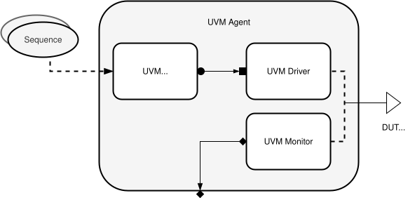

- [SPI Design — Verification Specification Document](#spi-design--verification-specification-document)
  - [1. Introduction](#1-introduction)
    - [1.1 Objective](#11-objective)
    - [1.2 Scope](#12-scope)
    - [1.3 References](#13-references)
    - [1.4 Applicable Documents](#14-applicable-documents)
  - [2. Design Overview](#2-design-overview)
    - [2.1 Design Under Verification (DUV)](#21-design-under-verification-duv)
    - [2.2 Functional Description Summary](#22-functional-description-summary)
    - [2.3 Signal and Interface Description](#23-signal-and-interface-description)
  - [3. Verification Environment Architecture](#3-verification-environment-architecture)
    - [3.1 Testbench Hierarchy](#31-testbench-hierarchy)
    - [3.2 UVM Components Overview](#32-uvm-components-overview)
    - [3.3 Interface Agents](#33-interface-agents)
    - [3.4 Communication Flow Diagram](#34-communication-flow-diagram)
  - [4. Verification Plan](#4-verification-plan)
    - [4.1 Verification Strategy](#41-verification-strategy)
    - [4.2 Test Categories](#42-test-categories)
    - [4.3 Functional Coverage Plan](#43-functional-coverage-plan)
    - [4.4 Assertions Plan](#44-assertions-plan)
    - [4.5 Scoreboard and Checking Mechanism](#45-scoreboard-and-checking-mechanism)
  - [5. Coverage and Metrics](#5-coverage-and-metrics)
  - [5.1. Coverage Goals](#51-coverage-goals)
  - [5.2. Coverage Structure](#52-coverage-structure)
    - [5.2 Covergroup Structure](#52-covergroup-structure)
    - [5.3 Coverage Crosses](#53-coverage-crosses)
    - [5.4 Metrics and Exit Criteria](#54-metrics-and-exit-criteria)
  - [6. Testcase Plan](#6-testcase-plan)
    - [6.1 Directed Tests](#61-directed-tests)
    - [6.2 Randomized Tests](#62-randomized-tests)
    - [6.3 Regression Strategy](#63-regression-strategy)
    - [6.4 Error Injection and Recovery Tests](#64-error-injection-and-recovery-tests)
  - [7. Verification Deliverables](#7-verification-deliverables)
    - [7.1 Reports and Logs](#71-reports-and-logs)
    - [7.2 Coverage Database](#72-coverage-database)
    - [7.3 Test Results Summary](#73-test-results-summary)
  - [8. Verification Closure](#8-verification-closure)
    - [8.1 Completion Criteria](#81-completion-criteria)
    - [8.2 Open Issue Tracking](#82-open-issue-tracking)
    - [8.3 Final Review Process](#83-final-review-process)

# SPI Design — Verification Specification Document

Section 1. Verification Plan
Revision: 1.0
Date: October 2025

## 1. Introduction

### 1.1 Objective
This document defines the Verification Specification for the **SPI_IP module**, describing the strategy, environment, coverage, and metrics used to ensure complete functional verification under the Universal Verification Methodology (UVM) framework.  
The goal is to guarantee that the design meets its functional and timing requirements according to the SPI protocol specification.

### 1.2 Scope
This verification plan applies to the `spi_ip` RTL module operating as an SPI Master. It covers protocol modes, timing variations, reset and recovery mechanisms, and FSM behavior.  
Verification activities include stimulus generation, functional checking, coverage collection, and assertion monitoring.

### 1.3 References
- IEEE Std 1800.2-2020 — *Universal Verification Methodology (UVM)*  
- IEEE Std 1800-2017 — *SystemVerilog Language Reference Manual*  
- SPI Bus Specification.  
- Project Specification Document: `spi_specs.md`

### 1.4 Applicable Documents
- SPI Functional Specification  
- UVM Testbench Architecture Description  
- Verification Environment User Guide 

## 2. Design Overview

### 2.1 Design Under Verification (DUV)
**Module Name:** `spi_ip`  
**Function:** SPI Master Controller  
**Design Language:** SystemVerilog  

The `spi_ip` module is responsible for transmitting and receiving serial data according to the SPI protocol, supporting multiple operating modes and programmable timing.

### 2.2 Functional Description Summary
The module supports 8-bit serial transmission and reception using the SPI master protocol.  
Main features include:
- Configurable clock polarity (`CPOL`) and phase (`CPHA`)
- Programmable clock divider (`dvsr_i`)
- Start/done handshake mechanism  
- FSM-based state control for SPI timing phases  
- Output clock generation on `sclk_o`
- Data shifting through `mosi_o` and `miso_i`

### 2.3 Signal and Interface Description

| **Category** | **Signal(s)** | **Description** |
|---------------|---------------|------------------|
| **Control** | `clk_i`, `rst_i`, `start_i`, `cpol_i`, `cpha_i`, `dvsr_i` | Control, reset, and configuration inputs |
| **Data** | `din_i`, `dout_o`, `mosi_o`, `miso_i` | Serial data input/output lines |
| **Status** | `ready_o`, `spi_done_tick_o` | Handshake and status indicators |
| **Clock Output** | `sclk_o` | Generated SPI clock |

---

## 3. Verification Environment Architecture

### 3.1 Testbench Hierarchy
The verification environment follows a **UVM-based layered structure**, including sequencers, drivers, monitors, scoreboards, and coverage collectors. The environment is designed to support constrained-random testing and coverage-driven verification.

### 3.2 UVM Components Overview
- **Environment (env):** Top-level container connecting all components.  
- **Agent:** Encapsulates the driver, monitor, and sequencer for the SPI interface.  
- **Driver:** Translates high-level sequence transactions into pin-level activity on the DUT.  
- **Monitor:** Passively observes SPI signals and collects transaction data.  
- **Sequencer:** Manages sequence execution and stimulus generation.  
- **Scoreboard:** Compares expected vs. actual results.  
- **Coverage Collector:** Tracks protocol-level functional coverage.  

   
  <em>Figure 1: SPI UVM Test Architecture</em>

### 3.3 Interface Agents
The SPI agent supports **active** and **passive** configurations. In active mode, it drives transactions through the `mosi` interface; in passive mode, it only monitors communication.

   
  <em>Figure 1: SPI UVM Agent</em>

### 3.4 Communication Flow Diagram
The UVM environment establishes communication through TLM (Transaction-Level Modeling) connections:
- The **sequencer** sends items to the **driver**.  
- The **monitor** reports observed transactions to the **scoreboard** and **coverage collector**.  
- The **environment** coordinates configuration and synchronization.

## 4. Verification Plan

### 4.1 Verification Strategy
A **coverage-driven verification** approach is adopted.  
Test scenarios will be generated both randomly and deterministically to achieve high functional coverage of all operational modes, timing configurations, and error conditions.  
Assertions will ensure protocol correctness and FSM consistency.

### 4.2 Test Categories
1. **Basic Functional Tests:** Validate basic data transmission and handshake.  
2. **Mode Tests:** Verify all combinations of CPOL and CPHA.  
3. **Clock Divider Tests:** Validate correct clock frequency generation.  
4. **Error/Reset Tests:** Assess behavior during mid-transfer resets.  
5. **Timing and FSM Tests:** Verify correct sequencing of SPI states.  
6. **Stress and Random Tests:** Exercise full coverage space.  

### 4.3 Functional Coverage Plan
Coverage items will track:
- SPI operational modes (`CPOL`, `CPHA`)  
- Clock divider values (`dvsr_i`)  
- FSM transitions (`IDLE`, `CPHA_DELAY`, `P0`, `P1`)  
- Handshake signals (`start_i`, `ready_o`, `spi_done_tick_o`)  
- Data transfer patterns (`din_i`, `dout_o`)  
- Reset and recovery sequences  

Cross coverage will ensure proper interaction between mode, timing, and data variations.

### 4.4 Assertions Plan
Assertions will be used to ensure protocol compliance, focusing on:
- Correct `SCLK` polarity and phase generation for each mode.  
- Proper timing between `start_i` and `spi_done_tick_o`.  
- FSM progression consistency (no illegal state transitions).  
- Data output stability during inactive clock phases.  
- Correct reset behavior and recovery after reset assertion.  

Assertions will complement coverage by providing immediate detection of protocol or design violations.

### 4.5 Scoreboard and Checking Mechanism
The scoreboard will:
- Compare transmitted and received data transactions.  
- Validate expected bit ordering and timing alignment.  
- Detect mismatches, underflows, or early completions.  
- Interface with the monitor and analysis ports for real-time comparison.

---

## 5. Coverage and Metrics

## 5.1. Coverage Goals

| Category | Goal |
|-----------|------|
| FSM state coverage | 100% |
| SPI mode coverage (CPOL/CPHA) | 100% (4 combinations) |
| Clock divider variations (`dvsr_i`) | ≥90% representative bins |
| Start/Done handshake | 100% |
| Data patterns (din_i, dout_o) | ≥95% |
| Transfer length & bit count (`n_reg`) | 100% (0–7) |
| Ready/Busy cycles | ≥95% |
| Reset recovery | 100% (reset during transaction tested) |

---

## 5.2. Coverage Structure

| Type | Location | Description |
|------|-----------|-------------|
| Transaction coverage | Monitor / Collector | Captures input/output data and mode configuration |
| FSM coverage | Monitor or internal probe | Captures transitions between FSM states |
| Timing/divider coverage | Monitor | Captures effects of `dvsr_i` on timing |
| Reset/Handshake coverage | Environment | Covers transitions of `start_i`, `ready_o`, and `spi_done_tick_o` |
| Mode cross coverage | Collector | Cross of (CPOL, CPHA) with data and timing |

---

### 5.2 Covergroup Structure
Coverage items will be organized by functionality:
- **Transaction Coverage:** Captures configuration and data transfers.  
- **FSM Coverage:** Monitors all valid state transitions.  
- **Timing Coverage:** Tracks divider and cycle timing variation.  
- **Handshake Coverage:** Observes protocol signaling and transitions.  
- **Mode Cross Coverage:** Combines mode, data, and timing conditions.

### 5.3 Coverage Crosses
Cross coverage will include:
- `(CPOL × CPHA × Data Pattern)`  
- `(CPOL × DVSRI × FSM Transition)`  
- `(Reset × Mode × Bit Count)`

### 5.4 Metrics and Exit Criteria

| **Metric** | **Target** |
|-------------|-------------|
| Total Functional Coverage | ≥ 95% |
| FSM Transitions | 100% |
| Mode Combinations | 100% |
| Data Pattern Bins | ≥ 95% |
| Reset Recovery | 100% |

---

## 6. Testcase Plan

### 6.1 Directed Tests
Directed tests will target specific protocol features to ensure deterministic coverage of basic and corner-case scenarios:
- SPI initialization and reset validation  
- Mode verification for all `CPOL/CPHA` combinations  
- Minimum and maximum divider values  
- Reset during transmission  

### 6.2 Randomized Tests
Constrained-random tests will explore protocol variations under randomized configurations:
- Random data patterns  
- Random divider values  
- Random delays between transactions  
- Combined mode and reset variations  

### 6.3 Regression Strategy
Regression runs will combine directed and randomized tests to accumulate functional coverage. Each test will be tagged for feature-based tracking and coverage contribution.

### 6.4 Error Injection and Recovery Tests
Dedicated testcases will inject protocol errors and mid-transfer resets to validate:
- Recovery behavior and FSM reinitialization  
- Data integrity post-reset  
- Correct re-synchronization on subsequent transfers  

---

## 7. Verification Deliverables

### 7.1 Reports and Logs
- Simulation run logs and summaries  
- Assertion status and violation reports  
- Functional coverage reports  

### 7.2 Coverage Database
A complete coverage database will be generated after each regression run for cumulative analysis and closure tracking.

### 7.3 Test Results Summary
A final test summary report will list all testcases executed, their objectives, and results (pass/fail/waived).

---

## 8. Verification Closure

### 8.1 Completion Criteria
Verification will be considered complete when:
- All coverage goals are met or justified.  
- All assertions pass without errors.  
- No open scoreboard mismatches exist.  
- Regression suite runs stable for multiple iterations.

### 8.2 Open Issue Tracking
All known design or verification issues will be logged, tracked, and reviewed in a centralized issue tracker before closure.

### 8.3 Final Review Process
The final verification review will include:
- Coverage and assertion summary  
- Issue resolution report  
- Regression stability results  
- Sign-off approval from verification and design leads

