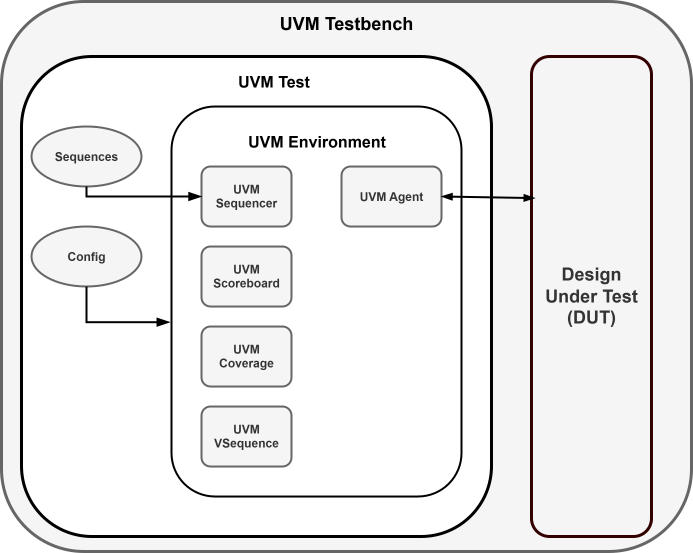

- [1. SPI Verification Plan Proposal](#1-spi-verification-plan-proposal)
- [SPI Verification Functional Coverage Plan](#spi-verification-functional-coverage-plan)
  - [1.1. Objective](#11-objective)
  - [1.2. Design Under Verification (DUV)](#12-design-under-verification-duv)
    - [1.2.2 Functional Description Summary:\*\*](#122-functional-description-summary)
  - [UVM Testbench Architecture proposar.](#uvm-testbench-architecture-proposar)
  - 
  - [1.3. Coverage Goals](#13-coverage-goals)
  - [4. Coverage Structure](#4-coverage-structure)
  - [1.1. SPI Interface](#11-spi-interface)
  - [1.2 Transaction Description](#12-transaction-description)
  - [1.7 Coverage Metrics and Exit Criteria](#17-coverage-metrics-and-exit-criteria)
  - [1.8. Sequence description](#18-sequence-description)

# 1. SPI Verification Plan Proposal
# SPI Verification Functional Coverage Plan

This document describes the verification proposal for the spi_ip IP block, whose spec can be found here.

## 1.1. Objective

This document defines the functional coverage plan for verifying the `spi_ip` module using UVM. 

The purpose of this coverage plan is to ensure that the UVM verification environment for the SPI module achieves complete functional observability and measurable verification progress against the protocol specification.

The purpose is to ensure that all SPI operational modes, control signal combinations, timing divisions, and FSM transitions are fully exercised and verified against the module specification.

The plan defines all covergroups, coverpoints, and crosses that must be implemented to guarantee full verification of protocol features such as operation modes (CPOL/CPHA), bit order, transfer sizes, clock timing, chip-select (CS) behavior, and error or recovery conditions.

Functional coverage complements assertion-based verification (SVA) and scoreboard checking to provide closure metrics for the verification process.

---

## 1.2. Design Under Verification (DUV)

**Module:** `spi_ip`  
**Interfaces:**
- Control: `clk_i`, `rst_i`, `start_i`, `cpol_i`, `cpha_i`, `dvsr_i`
- Data: `din_i`, `dout_o`, `mosi_o`, `miso_i`
- Status: `ready_o`, `spi_done_tick_o`
- Clock output: `sclk_o`

### 1.2.2 Functional Description Summary:**
- Implements SPI master transmission of 8-bit frames.
- Supports configurable SPI modes via `cpol_i` and `cpha_i`.
- Clock frequency is determined by `dvsr_i`.
- FSM states: `ST_IDLE`, `ST_CPHA_DELAY`, `ST_P0`, `ST_P1`.
- Serial data shift operations for `MOSI`/`MISO`.

---
## UVM Testbench Architecture proposar.

   
  <em>Figure 1: SPI UVM Test Architecture</em>

---

## 1.3. Coverage Goals

| Category | Goal |
|-----------|------|
| FSM state coverage | 100% |
| SPI mode coverage (CPOL/CPHA) | 100% (4 combinations) |
| Clock divider variations (`dvsr_i`) | ≥90% representative bins |
| Start/Done handshake | 100% |
| Data patterns (din_i, dout_o) | ≥95% |
| Transfer length & bit count (`n_reg`) | 100% (0–7) |
| Ready/Busy cycles | ≥95% |
| Error/reset recovery | 100% (reset during transaction tested) |

---

## 4. Coverage Structure

| Type | Location | Description |
|------|-----------|-------------|
| Transaction coverage | Monitor / Collector | Captures input/output data and mode configuration |
| FSM coverage | Monitor or internal probe | Captures transitions between FSM states |
| Timing/divider coverage | Monitor | Captures effects of `dvsr_i` on timing |
| Reset/Handshake coverage | Environment | Covers transitions of `start_i`, `ready_o`, and `spi_done_tick_o` |
| Mode cross coverage | Collector | Cross of (CPOL, CPHA) with data and timing |

---

The DUT pinout is shown below. 

As seen in the Table. 1. The DUT consists of a ...... 

The interface are described below: 

## 1.1. SPI Interface

## 1.2 Transaction Description

## 1.7 Coverage Metrics and Exit Criteria

| Metric                      | Target |
| --------------------------- | ------ |
| Total functional coverage   | ≥95%   |
| All FSM transitions covered | 100%   |
| SPI modes (4 combinations)  | 100%   |
| Data pattern bins           | ≥95%   |
| Reset recovery bins         | 100%   |

## 1.8. Sequence description

| Specification Item             | Covergroup           | Related Test                 |
| ------------------------------ | -------------------- | ---------------------------- |
| SPI Mode Selection (CPOL/CPHA) | `cg_mode_config`     | `test_all_modes`             |
| Clock Divider Variability      | `cg_mode_config`     | `test_divider_sweep`         |
| FSM Behavior                   | `cg_fsm_transitions` | `test_fsm_transition`        |
| Data Shifting                  | `cg_data_transfer`   | `test_data_patterns`         |
| Handshake                      | `cg_handshake`       | `test_start_done_sequence`   |
| Bit Counter                    | `cg_bit_count`       | `test_bit_counter`           |
| Reset Recovery                 | `cg_reset_behavior`  | `test_reset_during_transfer` |
