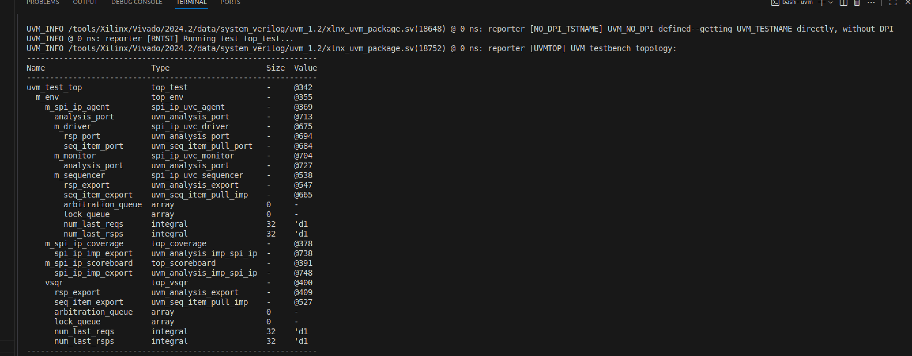

## IP UVM Verification

# Creation of templates for SPI verification using UVM

For this project, I included 5 folders where containing several files: 

- **Environment folder (env)**
 - top_coverage.sv
 - top_env_pkg.sv
 - top_env.sv
 - top_scoreboard.sv
 - top_vsqr.sv
- **Scripts folder**
 - makefiles
    - Makefile for vivado
 - setup
 - vivado
- **System verilog folder (sv)**
 - **Seqlib folder**
    - spi_ip_uvc_sequence_base
 - spi_ip_uvc_agent.sv
 - spi_ip_uvc_config.sv
 - spi_ip_uvc_driver.sv
 - spi_ip_uvc_if.sv
 - spi_ip_uvc_monitor.sv
 - spi_ip_uvc_pkg.sv
 - spi_ip_uvc_sequence_item.sv
 - spi_ip_uvc_sequencer.sv
- **tb folder**
 - tb.sv
- **test folder**
 - top_test_pkg.sv
 - top_test_vseq.sv
 - top_test.sv

Additionally, I included a picture showing the basic UVM architecture :

